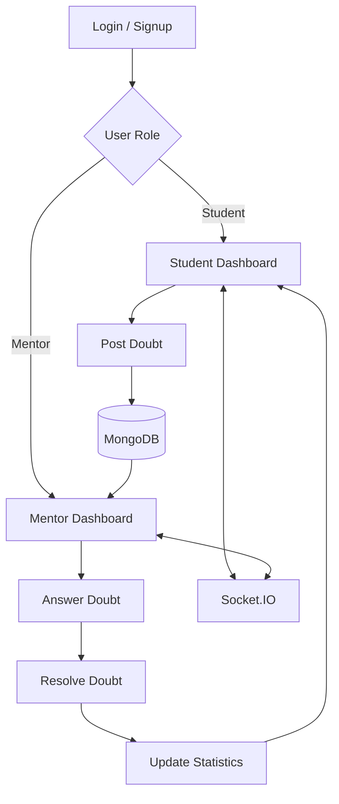
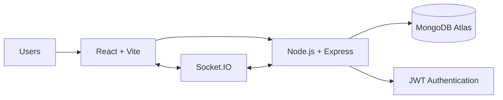

# 🎓 PeerHelp

<p align="center">
  <strong>A modern student–mentor platform for collaborative academic doubt solving.</strong>
</p>

<p align="center">
  <a href="https://peer-help-zeta.vercel.app/">
    
  </a>
  <a href="https://peerhelp-s3gw.onrender.com/">
    
  </a>
</p>

---

## 🌟 Overview

**PeerHelp** is a full-stack academic support platform that connects students and mentors in one collaborative workspace.

Students can post doubts and track their progress. Mentors can review questions, provide answers, edit responses, and resolve doubts. The platform includes authentication, statistics, pagination, and real-time Socket.IO communication.

## 🚀 Live Application

| Layer | Platform | Link |
|---|---|---|
| Frontend | Vercel | [Open PeerHelp](https://peer-help-zeta.vercel.app/) |
| Backend API | Render | [Open Backend](https://peerhelp-s3gw.onrender.com/) |
| Database | MongoDB Atlas | Private connection |

## ✨ Features

| Feature | Description |
|---|---|
| 🔐 Authentication | Student and mentor login/signup |
| 📝 Doubt Management | Create, view, answer, and resolve doubts |
| 👨‍🏫 Mentor Dashboard | Review and manage student questions |
| 📊 Statistics | Total, open, and resolved doubt counts |
| 📄 Pagination | Load More functionality for efficient loading |
| ⚡ Real-Time Updates | Socket.IO event integration |
| 🗃️ Database | MongoDB with Mongoose |
| ☁️ Deployment | Vercel frontend and Render backend |

## 🧭 Application Workflow



## 🏗️ System Architecture



## 🛠️ Technology Stack

| Layer | Technologies |
|---|---|
| Frontend | React, Vite, Axios, CSS |
| Backend | Node.js, Express.js |
| Authentication | JWT |
| Database | MongoDB, Mongoose, MongoDB Atlas |
| Real-Time Communication | Socket.IO |
| Version Control | Git, GitHub |
| Deployment | Vercel, Render |

## 📁 Project Structure

```text
PeerHelp/
├── frontend/
│   ├── src/
│   ├── public/
│   └── package.json
├── backend/
│   ├── models/
│   ├── routes/
│   ├── server.js
│   ├── socket.js
│   └── package.json
├── .gitignore
└── README.md
```

## ⚡ Performance Improvements

- MongoDB index on `createdAt`
- Field projection for smaller query responses
- `.lean()` queries for lightweight results
- Pagination using `page` and `limit`
- Load More dashboard experience
- Parallel statistics queries using `Promise.all()`

```http
GET /api/doubts?page=1&limit=10
GET /api/doubts/stats
```

## 🔌 API Overview

| Method | Endpoint | Purpose |
|---|---|---|
| GET | `/api/doubts` | Retrieve doubts |
| GET | `/api/doubts/count` | Retrieve total count |
| GET | `/api/doubts/stats` | Retrieve statistics |
| GET | `/api/doubts/:id` | Retrieve a specific doubt |
| POST | `/api/doubts` | Create a doubt |
| `/api/auth/...` | Authentication routes | Login and signup |

## ⚙️ Local Setup

```bash
git clone YOUR_GITHUB_REPOSITORY_URL
cd PeerHelp
```

### Backend

```bash
cd backend
npm install
npm start
```

Backend `.env`:

```env
MONGO_URI=your_mongodb_connection_string
JWT_SECRET=your_secure_jwt_secret
PORT=5000
FRONTEND_URL=http://localhost:5173
```

### Frontend

```bash
cd frontend
npm install
npm run dev
```

Frontend `.env`:

```env
VITE_API_URL=http://localhost:5000
```
## ✅ Deployment Checklist

- [x] Frontend deployed on Vercel
- [x] Backend deployed on Render
- [x] MongoDB connected
- [x] Authentication tested
- [x] Doubt posting tested
- [x] Mentor resolution tested
- [x] Statistics tested
- [x] Pagination tested
- [x] Production URLs configured

## 🔮 Future Enhancements

- Advanced search and filtering
- Subject categorization
- Enhanced notifications
- Mentor ratings and feedback
- Automated testing
- Advanced analytics
- Additional security controls

## 💡 Project Highlights

- Full-stack application development
- REST API integration
- JWT authentication
- MongoDB database integration
- Real-time Socket.IO communication
- Database query optimization
- Pagination and responsive dashboards
- Cloud deployment with Vercel and Render

---

<p align="center">
  <strong>PeerHelp — Connecting Students and Mentors Through Technology 💙</strong>
</p>
